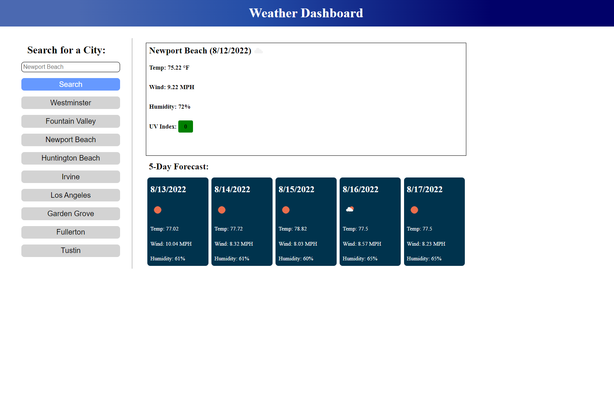

# Weather Dashboard ☀️⛅🌧️🌨️⛈️

Welcome! ☺️👋

## Description 📝

This webpage is a weather application. When you input a city in the search bar it populates the current weather and details of the weather along with a five day forecast. You will be able to use this to find out what the weather is today and the next five days to come with one search entry. 

## Deployed Webpage 🖥️

https://gbundakji.github.io/weather-dashboard/

## Visuals 📷

## Credit 🌎

https://home.openweathermap.org/

https://www.w3schools.com/js/js_api_intro.asp

https://rapidapi.com/blog/how-to-use-an-api-with-javascript/

https://coding-boot-camp.github.io/full-stack/apis/how-to-use-api-keys

https://developer.mozilla.org/en-US/docs/Learn/JavaScript/Client-side_web_APIs/Introduction

## License 🔑

MIT License

Copyright (c) [2022] [Gassan-Bundakji]

Permission is hereby granted, free of charge, to any person obtaining a copy of this software and associated documentation files (the "Software"), to deal in the Software without restriction, including without limitation the rights to use, copy, modify, merge, publish, distribute, sublicense, and/or sell copies of the Software, and to permit persons to whom the Software is furnished to do so, subject to the following conditions:

The above copyright notice and this permission notice shall be included in all copies or substantial portions of the Software.

THE SOFTWARE IS PROVIDED "AS IS", WITHOUT WARRANTY OF ANY KIND, EXPRESS OR IMPLIED, INCLUDING BUT NOT LIMITED TO THE WARRANTIES OF MERCHANTABILITY, FITNESS FOR A PARTICULAR PURPOSE AND NONINFRINGEMENT. IN NO EVENT SHALL THE AUTHORS OR COPYRIGHT HOLDERS BE LIABLE FOR ANY CLAIM, DAMAGES OR OTHER LIABILITY, WHETHER IN AN ACTION OF CONTRACT, TORT OR OTHERWISE, ARISING FROM, OUT OF OR IN CONNECTION WITH THE SOFTWARE OR THE USE OR OTHER DEALINGS IN THE SOFTWARE.